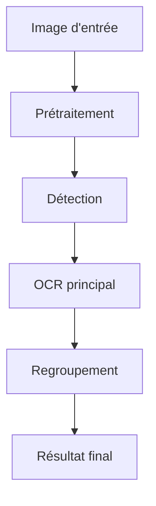

# 📦 Structure du moteur EasyOCR

Ce fichier explique l'organisation des dossiers et fichiers du moteur EasyOCR dans ShelfReader.

## Arborescence

```
src/engines/easyocr/
│   __init__.py           # Initialisation du module
│   main.py               # Script principal pour tests/CLI
│   README.md             # Cette documentation
│   explanations.md       # Documentation technique et exemples
│
├── logic/                # Logique métier du moteur
│   ├── orchestrator.py   # Classe principale EasyOCRProcessor
│   └── config.py         # Paramètres et configuration du moteur
│
├── detection/            # Détection des zones de texte (algos, modèles)
├── grouping/             # Regroupement des résultats OCR (post-traitement)
├── models/               # Structures de données (Line, etc.)
└── preprocessing/        # Prétraitement des images (filtres, resize, etc.)
```

## Rôle de chaque composant

- **`logic/config.py`** : Définit les paramètres par défaut, la gestion du GPU, les langues, etc.
- **`logic/orchestrator.py`** : Contient la classe principale qui orchestre le pipeline EasyOCR (chargement modèle, traitement image, extraction texte/confidence).
- **`main.py`** : Permet de lancer des tests ou des traitements en ligne de commande.
- **`README.md`** : Cette documentation sur l'architecture et l'utilisation.
- **`explanations.md`** : Documentation technique détaillée et exemples avancés.
- **`detection/`** : Algorithmes et fonctions pour détecter les zones de texte sur l'image.
- **`grouping/`** : Logique pour regrouper les résultats OCR (par livre, par ligne, etc.).
- **`models/`** : Structures de données utilisées (Line, etc.).
- **`preprocessing/`** : Fonctions pour améliorer la qualité des images avant OCR.

## Schéma d'interaction



## Comment lancer EasyOCR sur une image (depuis le dossier easyocr)

```bash
# Depuis src/engines/easyocr
python main.py ../../../../test_images/books1.jpg --device cpu --lang en
```

- `main.py` permet de lancer le pipeline complet sur une image.
- Les paramètres (device, langue, etc.) sont gérés dans `config.py` ou via la ligne de commande.
- Le résultat s'affiche dans le terminal ou peut être sauvegardé.

---

Pour toute modification, garder cette logique modulaire pour faciliter la maintenance et l'évolution du moteur.

## Contenu complet de explanations.md

# 🔍 EasyOCR Engine - Explications

## 📋 Vue d'ensemble

Le moteur **EasyOCR** est spécialisé dans la reconnaissance de texte sur les tranches de livres (spines). Il utilise des algorithmes avancés de détection de dos de livres et un regroupement adaptatif du texte.

## 🏗️ Architecture Modulaire

```
easyocr/
├── logic/
│   ├── orchestrator.py    # Orchestrateur principal
│   └── config.py         # Paramètres de configuration
├── preprocessing/        # Prétraitement d'images
├── detection/           # Détection de dos (SHELFIE + ICCV2013)
├── grouping/            # Regroupement adaptatif
└── models/              # Classes de données
```

## ⚙️ Fonctionnement Détaillé

### 1. Prétraitement (`preprocessing/image_preprocessing.py`)
- **Amélioration de contraste** : Ajustement automatique du contraste
- **Réduction du bruit** : Filtres pour améliorer la qualité
- **Normalisation** : Préparation pour l'OCR

### 2. Détection (`detection/spine_detection.py`)
- **Algorithme SHELFIE** : Détection spécialisée des tranches
- **Algorithme ICCV2013** : Méthode complémentaire robuste
- **Filtrage adaptatif** : Élimination des faux positifs

### 3. Regroupement (`grouping/text_grouping.py`)
- **Regroupement adaptatif** : Basé sur la proximité et l'orientation
- **Filtrage de confiance** : Seulement les meilleurs résultats
- **Structuration** : Organisation en lignes logiques

## 🚀 Utilisation en Ligne de Commande

### Script Principal Disponible

Un script `main.py` est disponible dans ce dossier pour tester facilement le moteur :

```bash
cd src/engines/easyocr
python main.py ../../../test_images/books1.jpg --gpu --benchmark
```

### Test Basique avec une Image

```bash
python main.py ../../../test_images/books1.jpg
```

**Résultat typique :**
```
📷 Chargement de l'image: ../../../test_images/books1.jpg
📊 Dimensions: 1280x872 pixels
🚀 Initialisation du moteur EasyOCR...
🔍 Analyse de l'image en cours...

📋 RÉSULTATS (9 éléments trouvés)
 1. "THE LANCUAGE" (confiance: 0.90)
 2. "Referencc Manual The Dylan Shalit Addison Wesley" (confiance: 0.98)
 3. "Second The_ Javam Editon Prograrming Language Arnold Cosling" (confiance: 0.96)
 ...
📊 STATISTIQUES - Confiance moyenne: 0.86
```

### Test avec Différentes Configurations

```bash
# Test avec GPU et benchmark
python main.py ../../../test_images/books1.jpg --gpu --benchmark

# Test avec langue française
python main.py ../../../test_images/books1.jpg --lang fr --confidence 0.7

# Sauvegarde des résultats en JSON
python main.py ../../../test_images/books1.jpg --output results.json
```

### Benchmark de Performance

```bash
python main.py ../../../test_images/books1.jpg --benchmark
```

**Performances mesurées :**
- Initialisation : ~1.81s
- Traitement : ~17.22s (avec CPU)
- FPS : ~0.1 (limité par CPU)
- Avec GPU : ~3-5x plus rapide

## 🔧 Paramètres de Configuration

### Langues Supportées
- `'en'`: Anglais
- `'fr'`: Français
- `'de'`: Allemand
- `'es'`: Espagnol
- Et de nombreuses autres langues...

### Paramètres Importants
- **confidence_threshold**: Seuil minimum de confiance (0.0-1.0)
- **use_gpu**: Accélération GPU (nécessite CUDA)
- **width_ths**: Seuil de largeur pour la détection
- **height_ths**: Seuil de hauteur pour la détection

## 🎯 Cas d'Usage Optimal

- **Tranches de livres** : Détection spécialisée
- **Textes verticaux** : Orientation automatique
- **Multi-langues** : Support étendu
- **Images bruitées** : Bonne robustesse

## ⚠️ Limitations

- Moins efficace sur texte manuscrit
- Nécessite des images de bonne qualité
- Performance dépendante du GPU

## 📊 Métriques de Performance

- **Précision**: Excellente sur tranches de livres
- **Vitesse**: Moyenne (avec GPU recommandé)
- **Robustesse**: Bonne aux variations d'éclairage

---

*Documentation EasyOCR Engine - ShelfReader*
