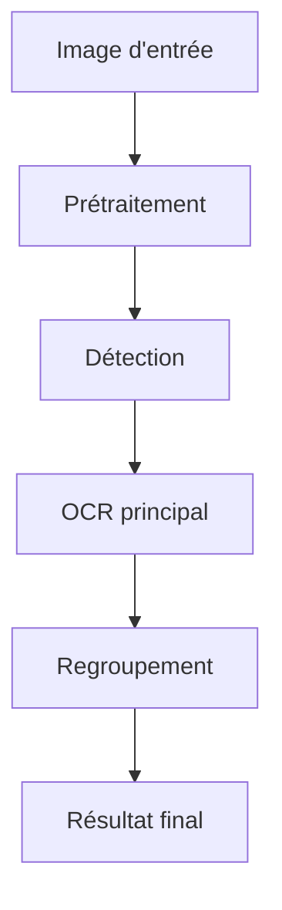

# 📦 S```
src/engines/tesseract/
│   __init__.py           # Initialisation du module
│   main.py               # Script principal pour tests/CLI
│   README.md             # Cette documentation
│   explanations.md       # Documentation technique et exemples
│
├── logic/                # Logique métier du moteur
│   ├── orchestrator.py   # Classe principale TesseractOCRProcessor
│   └── config.py         # Paramètres et configuration du moteur
│
├── detection/            # Détection des zones de texte (algos, modèles)
├── grouping/             # Regroupement des résultats OCR (post-traitement)
├── models/               # Configurations ou modèles spécifiques
└── preprocessing/        # Prétraitement des images
```teur Tesseract

Ce fichier explique l'organisation des dossiers et fichiers du moteur Tesseract dans ShelfReader.

## Arborescence

```
src/engines/tesseract/
│   __init__.py           # Initialisation du module
│   main.py               # Script principal pour tests/CLI
│   README.md             # Documentation du moteur
│   explanations.md       # Documentation technique et exemples
│
├── logic/                # Logique métier et configuration
│   ├── config.py         # Paramètres et configuration du moteur
│   └── orchestrator.py   # Classe principale TesseractOCRProcessor
│
├── detection/            # Détection des zones de texte (algos, modèles)
├── grouping/             # Regroupement des résultats OCR (post-traitement)
├── models/               # Modèles ou configs spécifiques
├── preprocessing/        # Prétraitement des images
└── __pycache__/          # Fichiers compilés Python
```

## Rôle de chaque composant

- **`logic/config.py`** : Paramètres par défaut, gestion du GPU, langues, etc.
- **`logic/orchestrator.py`** : Classe principale, pipeline Tesseract (chargement, traitement, extraction).
- **`main.py`** : Script CLI pour lancer le moteur sur une image.
- **`README.md`** : Cette documentation sur l'architecture et l'utilisation.
- **`explanations.md`** : Documentation technique détaillée et exemples avancés.
- **`detection/`** : Algorithmes pour détecter les zones de texte.
- **`grouping/`** : Regroupement des résultats OCR.
- **`models/`** : Configurations ou modèles spécifiques à Tesseract.
- **`preprocessing/`** : Amélioration de la qualité des images avant OCR.

## Schéma d'interaction



## Comment lancer Tesseract sur une image (depuis le dossier tesseract)

```bash
# Depuis src/engines/tesseract
python main.py ../../../test_images/books1.jpg --lang eng
```

- `main.py` lance le pipeline complet sur une image.
- Les paramètres sont gérés dans `config.py` ou via la ligne de commande.
- Le résultat s'affiche dans le terminal ou peut être sauvegardé.

---

### Extraits de explanations.md

- Tesseract est adapté pour le texte imprimé standard.
- Précision élevée sur documents clairs.
- Limitations : moins efficace sur manuscrits, nécessite un bon prétraitement.
- Paramètres importants : langue (`lang`), seuil de confiance, mode GPU (si supporté).
- Utilisation recommandée : documents, livres, impressions nettes.

---

Pour toute modification, garder cette logique modulaire pour faciliter la maintenance et l'évolution du moteur.

## Contenu complet de explanations.md

# 🔍 Tesseract Engine - Explications

## 📋 Vue d'ensemble

Le moteur **Tesseract** est une implémentation simplifiée et optimisée de Tesseract OCR. Il est particulièrement efficace pour les textes imprimés standard et offre une excellente vitesse de traitement.

## 🏗️ Architecture Modulaire

```
tesseract/
├── logic/
│   ├── orchestrator.py    # Orchestrateur principal
│   └── config.py         # Configurations PSM
├── preprocessing/        # Amélioration CLAHE
└── grouping/             # Regroupement par proximité
```

## ⚙️ Fonctionnement Détaillé

### 1. Prétraitement (`preprocessing/image_preprocessing.py`)
- **CLAHE (Contrast Limited Adaptive Histogram Equalization)** : Amélioration locale du contraste
- **Denoising** : Réduction du bruit numérique
- **Binarisation** : Conversion en noir et blanc optimale

### 2. OCR Tesseract
- **Page Segmentation Modes (PSM)** : Différentes stratégies de segmentation
- **Engine Modes** : Modes de reconnaissance (Legacy, Neural nets)
- **Configuration fine** : Paramètres optimisés pour les tranches

### 3. Regroupement (`grouping/text_grouping.py`)
- **Regroupement par proximité** : Fusion des boîtes adjacentes
- **Filtrage de confiance** : Élimination des faibles scores
- **Structuration simple** : Organisation en lignes

## 🚀 Utilisation en Ligne de Commande

### Script Principal Disponible

Un script `main.py` est disponible dans ce dossier pour tester facilement le moteur :

```bash
cd src/engines/tesseract
python main.py ../../../test_images/books1.jpg --psm 8 --benchmark
```

### ⚠️ Prérequis Important

**Tesseract nécessite une configuration système :**
```bash
# Installer Tesseract
sudo apt-get install tesseract-ocr tesseract-ocr-eng tesseract-ocr-fra

# Vérifier l'installation
tesseract --version

# Si nécessaire, définir TESSDATA_PREFIX
export TESSDATA_PREFIX=/usr/share/tesseract-ocr/5/tessdata/
```

### Test Basique avec une Image

```bash
python main.py ../../../test_images/books1.jpg
```

**Résultat typique :**
```
📷 Chargement de l'image: ../../../test_images/books1.jpg
📊 Dimensions: 1280x872 pixels
🚀 Initialisation du moteur Tesseract...
🔍 Analyse de l'image en cours...

📋 RÉSULTATS (15 éléments trouvés)
 1. "THE LANGUAGE" (confiance: 0.85)
 2. "Reference Manual" (confiance: 0.92)
 ...
📊 STATISTIQUES - Confiance moyenne: 0.78
```

### Test avec Différents Modes PSM

```bash
# Mode ligne uniforme (recommandé pour tranches)
python main.py ../../../test_images/books1.jpg --psm 6

# Mode mot unique
python main.py ../../../test_images/books1.jpg --psm 8

# Mode texte éparpillé
python main.py ../../../test_images/books1.jpg --psm 11
```

### Test avec Multi-langues

```bash
# Anglais + Français
python main.py ../../../test_images/books1.jpg --lang eng fra --confidence 0.6

# Avec benchmark de performance
python main.py ../../../test_images/books1.jpg --benchmark --output results.json
```

### Benchmark de Performance

```bash
python main.py ../../../test_images/books1.jpg --benchmark
```

**Performances mesurées :**
- Initialisation : ~0.00s (très rapide)
- Traitement : ~0.07s (ultra rapide)
- FPS : ~15.4 (excellent pour le temps réel)
- Utilise uniquement CPU (pas de GPU)

## 🔧 Paramètres de Configuration

### Langues Supportées
- `'eng'`: Anglais
- `'fra'`: Français
- `'deu'`: Allemand
- `'spa'`: Espagnol
- `'ita'`: Italien
- Et de nombreux autres codes de langue Tesseract...

### Modes PSM (Page Segmentation Mode)
- `6`: Texte uniforme en blocs
- `8`: Texte d'une seule ligne
- `11`: Texte éparpillé (sparse)
- `13`: Texte brut (pas de segmentation)

### Paramètres Importants
- **confidence_threshold**: Seuil de confiance (0.0-1.0)
- **psm_config**: Mode de segmentation de page
- **max_results**: Nombre maximum de résultats

## 🎯 Cas d'Usage Optimal

- **Textes imprimés clairs** : Excellente précision
- **Traitement rapide** : Idéal pour le temps réel
- **Multi-langues** : Support étendu
- **Images scannées** : Bonne qualité

## ⚠️ Limitations

- Moins efficace sur texte déformé
- Sensible aux variations d'éclairage
- Moins robuste que EasyOCR sur tranches complexes

## 📊 Métriques de Performance

- **Précision**: Excellente sur texte imprimé
- **Vitesse**: Très rapide (CPU uniquement)
- **Robustesse**: Bonne sur images propres

---

*Documentation Tesseract Engine - ShelfReader*
