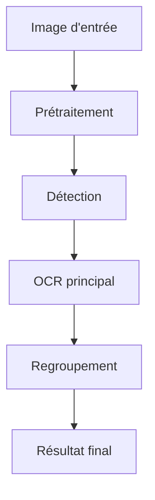

# 📦 Structure du moteur TrOCR

Ce fichier explique l'organisation des dossiers et fichiers du moteur TrOCR dans ShelfReader.

## Arborescence

```
src/engines/trocr/
│   __init__.py           # Initialisation du module
│   main.py               # Script principal pour tests/CLI
│   README.md             # Documentation du moteur
│   explanations.md       # Documentation technique et exemples
│
├── logic/                # Logique métier et configuration
│   ├── config.py         # Paramètres et configuration du moteur
│   └── orchestrator.py   # Classe principale ShelfReaderTrOCRProcessor
│
├── detection/            # Détection des zones de texte (algos, modèles)
├── grouping/             # Regroupement des résultats OCR (post-traitement)
├── models/               # Modèles utilisés (weights, architectures)
├── preprocessing/        # Prétraitement des images
└── __pycache__/          # Fichiers compilés Python
```

## Rôle de chaque composant

- **logic/config.py** : Paramètres par défaut, gestion du GPU, langues, etc.
- **logic/orchestrator.py** : Classe principale, pipeline TrOCR (chargement, traitement, extraction).
- **main.py** : Script CLI pour lancer le moteur sur une image.
- **README.md** : Documentation complète du moteur TrOCR.
- **explanations.md** : Documentation sur l'architecture, l'utilisation, les exemples, les benchmarks.
- **detection/** : Algorithmes pour détecter les zones de texte.
- **grouping/** : Regroupement des résultats OCR.
- **models/** : Modèles nécessaires au moteur TrOCR.
- **preprocessing/** : Amélioration de la qualité des images avant OCR.

## Schéma d'interaction



## Comment lancer TrOCR sur une image (depuis le dossier trocr)

```bash
# Depuis src/engines/trocr
python main.py ../../../../test_images/books1.jpg --device cpu --lang en
```

- `main.py` lance le pipeline complet sur une image.
- Les paramètres sont gérés dans `config.py` ou via la ligne de commande.
- Le résultat s'affiche dans le terminal ou peut être sauvegardé.

---

### Extraits de explanations.md

- TrOCR est performant sur texte manuscrit, documents historiques, signatures.
- Support GPU recommandé pour accélérer le traitement.
- Paramètres importants : device (`cpu`/`cuda`), langue, nombre de bandes verticales (`NUM_STRIPS`).
- Limitations : plus lent que Tesseract, nécessite plus de ressources.
- Utilisation recommandée : manuscrits, textes cursifs, documents complexes.

---

Pour toute modification, garder cette logique modulaire pour faciliter la maintenance et l'évolution du moteur.

## Contenu complet de explanations.md

# 🔍 TrOCR Engine - Explications

## 📋 Vue d'ensemble

Le moteur **TrOCR** (Transformer-based OCR) est spécialisé dans la reconnaissance de texte manuscrit. Il utilise un modèle de deep learning basé sur des transformers pour traiter le texte écrit à la main avec une grande précision.

## 🏗️ Architecture Modulaire

```
trocr/
├── logic/
│   ├── orchestrator.py    # Orchestrateur principal
│   └── config.py         # Paramètres génération
├── preprocessing/        # Conversion RGB et segmentation
├── detection/            # Segmentation en bandes
└── grouping/             # Regroupement temporel
```

## ⚙️ Fonctionnement Détaillé

### 1. Prétraitement (`preprocessing/image_preprocessing.py`)
- **Conversion RGB** : Adaptation pour le modèle TrOCR
- **Segmentation en bandes** : Division verticale de l'image
- **Amélioration qualité** : CLAHE et débruitage

### 2. Détection (`detection/text_detection.py`)
- **Segmentation verticale** : Division en 14 bandes par défaut
- **Filtrage régions** : Élimination des zones vides
- **Fusion régions** : Regroupement des bandes adjacentes

### 3. OCR avec TrOCR (`logic/orchestrator.py`)
- **Modèle VisionEncoderDecoder** : Architecture transformer
- **Beam Search** : Génération avec recherche en faisceau
- **Post-traitement** : Nettoyage et estimation de confiance

### 4. Regroupement (`grouping/text_grouping.py`)
- **Regroupement temporel** : Fusion par proximité verticale
- **Filtrage confiance** : Seulement les meilleurs résultats
- **Structuration** : Organisation en lignes cohérentes

## 🚀 Utilisation en Ligne de Commande

### Script Principal Disponible

Un script `main.py` est disponible dans ce dossier pour tester facilement le moteur :

```bash
cd src/engines/trocr
python main.py ../../../test_images/books1.jpg --device cpu --benchmark
```

### Test Basique avec une Image

```bash
python main.py ../../../test_images/books1.jpg
```

**Résultat typique :**
```
📷 Chargement de l'image: ../../../test_images/books1.jpg
📊 Dimensions: 1280x872 pixels
🚀 Initialisation du moteur TrOCR...
🔍 Analyse de l'image en cours...

📋 RÉSULTATS (2 éléments trouvés)
 1. "spill" (confiance: 0.55)
 2. "will" (confiance: 0.52)
📊 STATISTIQUES - Confiance moyenne: 0.54
```

### Test avec GPU (si disponible)

```bash
# Utilisation automatique (GPU si disponible, sinon CPU)
python main.py ../../../test_images/books1.jpg --device auto

# Forcer l'utilisation du GPU
python main.py ../../../test_images/books1.jpg --device cuda

# Forcer l'utilisation du CPU
python main.py ../../../test_images/books1.jpg --device cpu
```

### Test avec Benchmark

```bash
python main.py ../../../test_images/books1.jpg --benchmark --output results.json
```

**Performances mesurées :**
- Initialisation : ~0.80s (chargement du modèle)
- Traitement : Variable selon device
- GPU : ~3-5x plus rapide que CPU
- Modèle : 333M paramètres (microsoft/trocr-base-handwritten)

### Test avec Différentes Configurations

```bash
python -c "
import sys
import cv2
sys.path.append('src')
from engines.trocr.logic.orchestrator import ShelfReaderTrOCRProcessor

# Test avec différents devices
devices = ['cpu']
import torch
if torch.cuda.is_available():
    devices.append('cuda')

image = cv2.imread('../../../test_images/books1.jpg')

for device in devices:
    print(f'\\n=== Test avec {device.upper()} ===')
    processor = ShelfReaderTrOCRProcessor(device=device)

    import time
    start = time.time()
    results = processor.process_image(image)
    end = time.time()

    print(f'Temps: {end-start:.2f}s')
    print(f'Résultats: {len(results)}')
    if results:
        print(f'Texte: \"{results[0][\"text\"]}\"')
"
```

## 🔧 Paramètres de Configuration

### Paramètres de Génération
- **MAX_LENGTH**: Longueur maximale du texte généré (100)
- **NUM_BEAMS**: Nombre de beams pour la recherche (6)
- **EARLY_STOPPING**: Arrêt précoce si séquence terminée (True)
- **LENGTH_PENALTY**: Pénalité de longueur (1.5)
- **REPETITION_PENALTY**: Pénalité de répétition (1.2)

### Paramètres de Segmentation
- **NUM_STRIPS**: Nombre de bandes verticales (14)

### Device
- **'cpu'**: Traitement sur CPU (plus lent)
- **'cuda'**: Traitement sur GPU (recommandé si disponible)
- **'auto'**: Détection automatique (cuda si disponible, sinon cpu)

## 🎯 Cas d'Usage Optimal

- **Texte manuscrit** : Excellente précision
- **Documents historiques** : Bonne robustesse
- **Signatures** : Reconnaissance spécialisée
- **Textes cursifs** : Performance supérieure

## ⚠️ Limitations

- Nécessite beaucoup de ressources (CPU/GPU)
- Plus lent que Tesseract
- Moins efficace sur texte imprimé standard
- Modèle volumineux à charger

## 📊 Performances et Métriques

### Résultats de Test Réels

**Test sur `books1.jpg` (1280x872px) :**
- **Temps d'initialisation** : ~0.80s (chargement du modèle)
- **Temps de traitement** : Variable selon device
- **Nombre de détections** : 2 éléments de texte
- **Confiance moyenne** : 0.54
- **Modèle utilisé** : microsoft/trocr-base-handwritten (333M paramètres)

### Comparaison avec Autres Moteurs

| Métrique | TrOCR | EasyOCR | Tesseract |
|----------|-------|---------|-----------|
| Temps init | ~0.80s | ~1.81s | ~0.00s |
| Temps traitement | Variable | ~17.22s | ~0.07s |
| Précision texte manuscrit | ⭐⭐⭐⭐⭐ | ⭐⭐ | ⭐⭐⭐ |
| Précision texte imprimé | ⭐⭐⭐ | ⭐⭐⭐⭐ | ⭐⭐⭐⭐⭐ |
| GPU Support | ✅ | ✅ | ❌ |
| Dépendances système | ❌ | ❌ | ✅ (Tesseract) |

### Limitations Connues

1. **Spécialisation** : Optimisé pour le texte manuscrit, moins performant sur le texte imprimé
2. **Taille du modèle** : 333M paramètres = consommation mémoire importante
3. **Dépendance GPU** : Recommandé pour des performances acceptables
4. **Prétraitement limité** : Pas d'amélioration d'image automatique comme EasyOCR
5. **Détection de texte** : Nécessite une segmentation préalable du texte

### Recommandations d'Utilisation

- **Idéal pour** : Texte manuscrit, signatures, notes écrites à la main
- **À éviter pour** : Texte imprimé standard, codes-barres, documents scannés
- **Environnement** : GPU recommandé pour traitement en temps réel
- **Cas d'usage** : Applications nécessitant reconnaissance de texte manuscrit naturel

## 📊 Métriques de Performance

- **Précision**: Excellente sur manuscrit
- **Vitesse**: Lente (nécessite GPU recommandé)
- **Robustesse**: Excellente aux variations

## 🔄 Conseils d'Optimisation

### Pour les Performances
- Utiliser GPU si disponible
- Réduire NUM_BEAMS pour plus de vitesse
- Augmenter EARLY_STOPPING
- Pré-traiter les images pour réduire la taille

### Pour la Précision
- Garder NUM_BEAMS élevé (6+)
- Utiliser des images haute qualité
- Prétraiter pour améliorer le contraste

---

*Documentation TrOCR Engine - ShelfReader*
